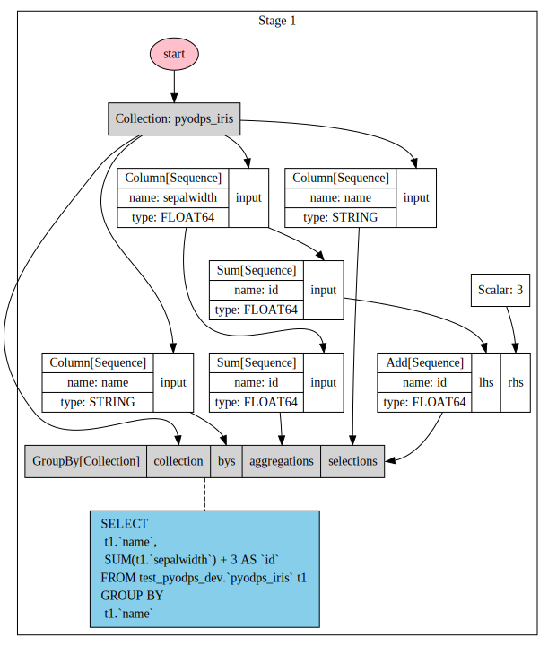

.. _dfdebuginstruction:

调试指南
=========

可视化DataFrame
~~~~~~~~~~~~~~~~~~~

由于PyODPS DataFrame本身会对整个操作执行优化，为了能直观地反应整个过程，
我们可以使用可视化的方式显示整个表达式的计算过程。

值得注意的是，可视化需要依赖 `graphviz 软件 <http://www.graphviz.org/Download..php>`_ 和 **graphviz** Python 包。

.. code:: python

    >>> df = iris.groupby('name').agg(id=iris.sepalwidth.sum())
    >>> df = df[df.name, df.id + 3]
    >>> df.visualize()

可以看到，这个计算过程中，PyODPS DataFrame将GroupBy和列筛选做了操作合并。

.. code:: python

    >>> df = iris.groupby('name').agg(id=iris.sepalwidth.sum()).cache()
    >>> df2 = df[df.name, df.id + 3]
    >>> df2.visualize()

.. image:: _static/df-op-merge-visualize.svg

此时，由于用户执行了cache操作，这时整个执行计划将会分成两步来执行。

ODPS SQL后端查看编译结果
~~~~~~~~~~~~~~~~~~~~~~~~

我们可以直接调用 ``compile`` 方法来查看ODPS SQL后端编译到SQL的结果。

.. code:: python

    >>> df = iris.groupby('name').agg(sepalwidth=iris.sepalwidth.max())
    >>> df.compile()
    Stage 1:

    SQL compiled:

    SELECT
      t1.`name`,
      MAX(t1.`sepalwidth`) AS `sepalwidth`
    FROM test_pyodps_dev.`pyodps_iris` t1
    GROUP BY
      t1.`name`

使用pandas计算后端执行本地调试
~~~~~~~~~~~~~~~~~~~~~~~~~~~~~~~~~~

对于来自ODPS表的DataFrame，一些操作不会compile到ODPS SQL执行，而是会使用Tunnel下载，
这个过程是很快的，且无需等待ODPS SQL任务的调度。
利用这个特性，我们能快速下载小部分ODPS数据到本地，使用pandas计算后端来进行代码编写和调试。

这些操作包括：

* 对非分区表进行选取整个或者有限条数据、或者列筛选的操作（不包括列的各种计算），以及计算其数量
* 对分区表不选取分区或筛选前几个分区字段，对其进行选取全部或者有限条数据、或者列筛选的操作，以及计算其数量

如我们的iris这个DataFrame的来源ODPS表是非分区表，以下操作会使用tunnel进行下载。

.. code:: python

    >>> iris.count()
    >>> iris['name', 'sepalwidth'][:10]

对于分区表，如有个DataFrame来源于分区表（有三个分区字段，ds、hh、mm），以下操作会使用tunnel下载。

.. code:: python

    >>> df[:10]
    >>> df[df.ds == '20160808']['f0', 'f1']
    >>> df[(df.ds == '20160808') & (df.hh == 3)][:10]
    >>> df[(df.ds == '20160808') & (df.hh == 3) & (df.mm == 15)]

因此我们可以使用 ``to_pandas`` 方法来将部分数据下载到本地来进行调试，我们可以写出如下代码：

.. code:: python

    >>> DEBUG = True

.. code:: python

    >>> if DEBUG:
    >>>     df = iris[:100].to_pandas(wrap=True)
    >>> else:
    >>>     df = iris

这样，当我们全部编写完成时，再把 ``DEBUG`` 设置为False就可以在ODPS上执行完整的计算了。

.. note::

    **由于沙箱的限制，本地调试通过的程序不一定能在ODPS上也跑通。**