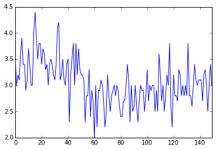
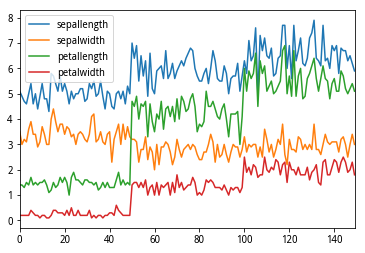
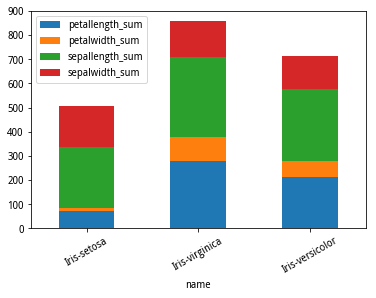

.. _dfplot:

绘图
====

PyODPS
DataFrame提供了绘图的方法。如果要使用绘图，需要 **pandas** 和 **matplotlib** 的安装。

接下来的例子都是在jupyter中运行。

.. code:: python

    >>> from odps.df import DataFrame
    >>> iris = DataFrame(o.get_table('pyodps_iris'))
    >>> %matplotlib inline
    >>> iris.sepalwidth.plot()
    <matplotlib.axes._subplots.AxesSubplot at 0x10c2b3510>

.. code:: python

    >>> iris.plot()
    <matplotlib.axes._subplots.AxesSubplot at 0x10db7e690>

.. code:: python

    >>> iris.groupby('name').sum().plot(kind='bar', x='name', stacked=True, rot=30)
    <matplotlib.axes._subplots.AxesSubplot at 0x10c5f2090>

.. code:: python

    >>> iris.hist(sharex=True)
    array([[<matplotlib.axes._subplots.AxesSubplot object at 0x10e013f90>,
            <matplotlib.axes._subplots.AxesSubplot object at 0x10e2d1c10>],
           [<matplotlib.axes._subplots.AxesSubplot object at 0x10e353f10>,
            <matplotlib.axes._subplots.AxesSubplot object at 0x10e3c4410>]], dtype=object)

.. image:: _static/df-plot-iris-hist.png

参数\ ``kind``\ 表示了绘图的类型，支持的包括：

======== =============
 kind     说明
======== =============
 line     线图
 bar      竖向柱状图
 barh     横向柱状图
 hist     直方图
 box      boxplot
 kde      核密度估计
 density  和kde相同
 area
 pie      饼图
 scatter  散点图
 hexbin
======== =============

详细参数可以参考Pandas文档：http://pandas.pydata.org/pandas-docs/stable/generated/pandas.DataFrame.plot.html

除此之外，plot函数还增加了几个参数，方便进行绘图。

============ =============
 参数         说明
============ =============
 xlabel       x轴名
 ylabel       y轴名
 xlabelsize   x轴名大小
 ylabelsize   y轴名大小
 labelsize    轴名大小
 title        标题
 titlesize    标题大小
 annotate     是否标记值
============ =============
