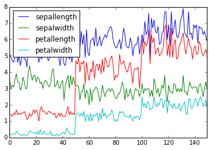
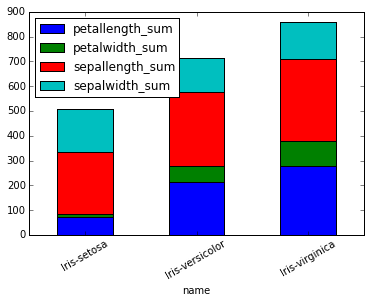
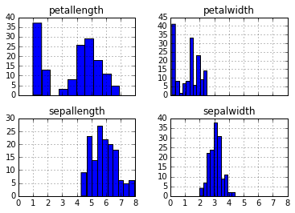

.. _dfplot:

绘图
====

PyOdps
DataFrame提供了绘图的方法。如果要使用绘图，需要 **pandas** 和 **matplotlib** 的安装。

.. code:: python

    from odps.df import DataFrame

.. code:: python

    iris = DataFrame(o.get_table('pyodps_iris'))

.. code:: python

    %matplotlib inline

.. code:: python

    iris.sepalwidth.plot()

.. parsed-literal::

    <matplotlib.axes._subplots.AxesSubplot at 0x10c2b3510>

.. image:: _static/output_7_1.png

.. code:: python

    iris.plot()

.. parsed-literal::

    <matplotlib.axes._subplots.AxesSubplot at 0x10db7e690>

.. code:: python

    iris.groupby('name').sum().plot(kind='bar', x='name', stacked=True, rot=30)

.. parsed-literal::

    <matplotlib.axes._subplots.AxesSubplot at 0x10c5f2090>

.. code:: python

    iris.hist(sharex=True)

.. parsed-literal::

    array([[<matplotlib.axes._subplots.AxesSubplot object at 0x10e013f90>,
            <matplotlib.axes._subplots.AxesSubplot object at 0x10e2d1c10>],
           [<matplotlib.axes._subplots.AxesSubplot object at 0x10e353f10>,
            <matplotlib.axes._subplots.AxesSubplot object at 0x10e3c4410>]], dtype=object)

参数\ ``kind``\ 表示了绘图的类型，支持的包括：

.. raw:: html

    

    <table border="1" class="dataframe">
      <tr>
        <th>kind</th>
        <th>说明</th>
      </tr>
      <tr>
        <td>line</td>
        <td>线图</td>
      </tr>
      <tr>
        <td>bar</td>
        <td>竖向柱状图</td>
      </tr>
      <tr>
        <td>barh</td>
        <td>横向柱状图</td>
      </tr>
      <tr>
        <td>hist</td>
        <td>直方图</td>
      </tr>
      <tr>
        <td>box</td>
        <td>boxplot</td>
      </tr>
      <tr>
        <td>kde</td>
        <td>核密度估计</td>
      </tr>
      <tr>
        <td>density</td>
        <td>和kde相同</td>
      </tr>
      <tr>
        <td>area</td>
        <td></td>
      </tr>
      <tr>
        <td>pie</td>
        <td>饼图</td>
      </tr>
      <tr>
        <td>scatter</td>
        <td>散点图</td>
      </tr>
      <tr>
        <td>hexbin</td>
        <td></td>
      </tr>
    </table>
    

详细参数可以参考Pandas文档：http://pandas.pydata.org/pandas-docs/stable/generated/pandas.DataFrame.plot.html
