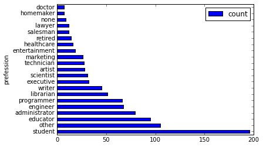

.. _dfquickstart:

快速开始
========

.. code:: python

    o = ODPS('**your-access-id**', '**your-secret-access-key**',
             project='**your-project**', endpoint='**your-end-point**'))

我们拿movielens
100K来做例子。现在我们已经有三张表了，分别是\ ``pyodps_ml_100k_movies``\ （电影相关的数据），\ ``pyodps_ml_100k_users``\ （用户相关的数据），\ ``pyodps_ml_100k_ratings``\ （评分有关的数据）。

创建一个DataFrame对象十分容易，只需传入Table对象即可。

.. code:: python

    from odps.df import DataFrame

.. code:: python

    users = DataFrame(o.get_table('pyodps_ml_100k_users'))

我们可以通过dtypes属性来查看这个DataFrame有哪些字段，分别是什么类型

.. code:: python

    users.dtypes

.. parsed-literal::

    odps.Schema {
      user_id             int64       
      age                 int64       
      sex                 string      
      occupation          string      
      zip_code            string      
    }

通过head方法，我们能取前N条数据，这让我们能快速预览数据。

.. code:: python

    users.head(10)

.. raw:: html

    

    <table border="1" class="dataframe">
      <thead>
        <tr style="text-align: right;">
          <th></th>
          <th>user_id</th>
          <th>age</th>
          <th>sex</th>
          <th>occupation</th>
          <th>zip_code</th>
        </tr>
      </thead>
      <tbody>
        <tr>
          <th>0</th>
          <td>1</td>
          <td>24</td>
          <td>M</td>
          <td>technician</td>
          <td>85711</td>
        </tr>
        <tr>
          <th>1</th>
          <td>2</td>
          <td>53</td>
          <td>F</td>
          <td>other</td>
          <td>94043</td>
        </tr>
        <tr>
          <th>2</th>
          <td>3</td>
          <td>23</td>
          <td>M</td>
          <td>writer</td>
          <td>32067</td>
        </tr>
        <tr>
          <th>3</th>
          <td>4</td>
          <td>24</td>
          <td>M</td>
          <td>technician</td>
          <td>43537</td>
        </tr>
        <tr>
          <th>4</th>
          <td>5</td>
          <td>33</td>
          <td>F</td>
          <td>other</td>
          <td>15213</td>
        </tr>
        <tr>
          <th>5</th>
          <td>6</td>
          <td>42</td>
          <td>M</td>
          <td>executive</td>
          <td>98101</td>
        </tr>
        <tr>
          <th>6</th>
          <td>7</td>
          <td>57</td>
          <td>M</td>
          <td>administrator</td>
          <td>91344</td>
        </tr>
        <tr>
          <th>7</th>
          <td>8</td>
          <td>36</td>
          <td>M</td>
          <td>administrator</td>
          <td>05201</td>
        </tr>
        <tr>
          <th>8</th>
          <td>9</td>
          <td>29</td>
          <td>M</td>
          <td>student</td>
          <td>01002</td>
        </tr>
        <tr>
          <th>9</th>
          <td>10</td>
          <td>53</td>
          <td>M</td>
          <td>lawyer</td>
          <td>90703</td>
        </tr>
      </tbody>
    </table>
    

有时候，我们并不需要都看到所有字段，我们可以从中筛选出一部分。

.. code:: python

    users[['user_id', 'age']].head(5)

.. raw:: html

    

    <table border="1" class="dataframe">
      <thead>
        <tr style="text-align: right;">
          <th></th>
          <th>user_id</th>
          <th>age</th>
        </tr>
      </thead>
      <tbody>
        <tr>
          <th>0</th>
          <td>1</td>
          <td>24</td>
        </tr>
        <tr>
          <th>1</th>
          <td>2</td>
          <td>53</td>
        </tr>
        <tr>
          <th>2</th>
          <td>3</td>
          <td>23</td>
        </tr>
        <tr>
          <th>3</th>
          <td>4</td>
          <td>24</td>
        </tr>
        <tr>
          <th>4</th>
          <td>5</td>
          <td>33</td>
        </tr>
      </tbody>
    </table>
    

有时候我们只是排除个别字段。

.. code:: python

    users.exclude('zip_code', 'age').head(5)

.. raw:: html

    

    <table border="1" class="dataframe">
      <thead>
        <tr style="text-align: right;">
          <th></th>
          <th>user_id</th>
          <th>sex</th>
          <th>occupation</th>
        </tr>
      </thead>
      <tbody>
        <tr>
          <th>0</th>
          <td>1</td>
          <td>M</td>
          <td>technician</td>
        </tr>
        <tr>
          <th>1</th>
          <td>2</td>
          <td>F</td>
          <td>other</td>
        </tr>
        <tr>
          <th>2</th>
          <td>3</td>
          <td>M</td>
          <td>writer</td>
        </tr>
        <tr>
          <th>3</th>
          <td>4</td>
          <td>M</td>
          <td>technician</td>
        </tr>
        <tr>
          <th>4</th>
          <td>5</td>
          <td>F</td>
          <td>other</td>
        </tr>
      </tbody>
    </table>
    

又或者，排除掉一些字段的同时，得通过计算得到一些新的列，比如我想将sex为M的置为True，否则为False，并取名叫sex\_bool。

.. code:: python

    users.select(users.exclude('zip_code', 'sex'), sex_bool=users.sex == 'M').head(5)

.. raw:: html

    

    <table border="1" class="dataframe">
      <thead>
        <tr style="text-align: right;">
          <th></th>
          <th>user_id</th>
          <th>age</th>
          <th>occupation</th>
          <th>sex_bool</th>
        </tr>
      </thead>
      <tbody>
        <tr>
          <th>0</th>
          <td>1</td>
          <td>24</td>
          <td>technician</td>
          <td>True</td>
        </tr>
        <tr>
          <th>1</th>
          <td>2</td>
          <td>53</td>
          <td>other</td>
          <td>False</td>
        </tr>
        <tr>
          <th>2</th>
          <td>3</td>
          <td>23</td>
          <td>writer</td>
          <td>True</td>
        </tr>
        <tr>
          <th>3</th>
          <td>4</td>
          <td>24</td>
          <td>technician</td>
          <td>True</td>
        </tr>
        <tr>
          <th>4</th>
          <td>5</td>
          <td>33</td>
          <td>other</td>
          <td>False</td>
        </tr>
      </tbody>
    </table>
    

现在，让我们看看年龄在20到25岁之间的人有多少个

.. code:: python

    users.age.between(20, 25).count().rename('count')

.. code:: python

    943

接下来，我们看看男女用户分别有多少。

.. code:: python

    users.groupby(users.sex).count()

.. raw:: html

    

    <table border="1" class="dataframe">
      <thead>
        <tr style="text-align: right;">
          <th></th>
          <th>sex</th>
          <th>count</th>
        </tr>
      </thead>
      <tbody>
        <tr>
          <th>0</th>
          <td>F</td>
          <td>273</td>
        </tr>
        <tr>
          <th>1</th>
          <td>M</td>
          <td>670</td>
        </tr>
      </tbody>
    </table>
    

用户按职业划分，从高到底，人数最多的前10职业是哪些呢？

.. code:: python

    df = users.groupby('occupation').agg(count=users['occupation'].count())
    df.sort(df['count'], ascending=False)[:10]

.. raw:: html

    

    <table border="1" class="dataframe">
      <thead>
        <tr style="text-align: right;">
          <th></th>
          <th>occupation</th>
          <th>count</th>
        </tr>
      </thead>
      <tbody>
        <tr>
          <th>0</th>
          <td>student</td>
          <td>196</td>
        </tr>
        <tr>
          <th>1</th>
          <td>other</td>
          <td>105</td>
        </tr>
        <tr>
          <th>2</th>
          <td>educator</td>
          <td>95</td>
        </tr>
        <tr>
          <th>3</th>
          <td>administrator</td>
          <td>79</td>
        </tr>
        <tr>
          <th>4</th>
          <td>engineer</td>
          <td>67</td>
        </tr>
        <tr>
          <th>5</th>
          <td>programmer</td>
          <td>66</td>
        </tr>
        <tr>
          <th>6</th>
          <td>librarian</td>
          <td>51</td>
        </tr>
        <tr>
          <th>7</th>
          <td>writer</td>
          <td>45</td>
        </tr>
        <tr>
          <th>8</th>
          <td>executive</td>
          <td>32</td>
        </tr>
        <tr>
          <th>9</th>
          <td>scientist</td>
          <td>31</td>
        </tr>
      </tbody>
    </table>
    

DataFrame API提供了value\_counts这个方法来快速达到同样的目的。

.. code:: python

    users.occupation.value_counts()[:10]

.. raw:: html

    

    <table border="1" class="dataframe">
      <thead>
        <tr style="text-align: right;">
          <th></th>
          <th>occupation</th>
          <th>count</th>
        </tr>
      </thead>
      <tbody>
        <tr>
          <th>0</th>
          <td>student</td>
          <td>196</td>
        </tr>
        <tr>
          <th>1</th>
          <td>other</td>
          <td>105</td>
        </tr>
        <tr>
          <th>2</th>
          <td>educator</td>
          <td>95</td>
        </tr>
        <tr>
          <th>3</th>
          <td>administrator</td>
          <td>79</td>
        </tr>
        <tr>
          <th>4</th>
          <td>engineer</td>
          <td>67</td>
        </tr>
        <tr>
          <th>5</th>
          <td>programmer</td>
          <td>66</td>
        </tr>
        <tr>
          <th>6</th>
          <td>librarian</td>
          <td>51</td>
        </tr>
        <tr>
          <th>7</th>
          <td>writer</td>
          <td>45</td>
        </tr>
        <tr>
          <th>8</th>
          <td>executive</td>
          <td>32</td>
        </tr>
        <tr>
          <th>9</th>
          <td>scientist</td>
          <td>31</td>
        </tr>
      </tbody>
    </table>
    

让我们用更直观的图来看这份数据。

.. code:: python

    %matplotlib inline

我们可以用个横向的柱状图来可视化

.. code:: python

    users['occupation'].value_counts().plot(kind='barh', x='occupation', ylabel='prefession')

.. parsed-literal::

    <matplotlib.axes._subplots.AxesSubplot at 0x10653cfd0>

我们将年龄分成30组，来看个年龄分布的直方图

.. code:: python

    users.age.hist(bins=30, title="Distribution of users' ages", xlabel='age', ylabel='count of users')

.. parsed-literal::

    <matplotlib.axes._subplots.AxesSubplot at 0x10667a510>

.. image:: _static/df-age-hist.png

好了，现在我们把这三张表联合起来，只需要使用join就可以了。join完成后我们把它保存成一张新的表。

.. code:: python

    movies = DataFrame(o.get_table('pyodps_ml_100k_movies'))
    ratings = DataFrame(o.get_table('pyodps_ml_100k_ratings'))
    
    o.delete_table('pyodps_ml_100k_lens', if_exists=True)
    lens = movies.join(ratings).join(users).persist('pyodps_ml_100k_lens')

.. code:: python

    lens.dtypes

.. parsed-literal::

    odps.Schema {
      movie_id                            int64       
      title                               string      
      release_date                        string      
      video_release_date                  string      
      imdb_url                            string      
      user_id                             int64       
      rating                              int64       
      unix_timestamp                      int64       
      age                                 int64       
      sex                                 string      
      occupation                          string      
      zip_code                            string      
    }

现在我们把年龄分成从0到80岁，分成8个年龄段，

.. code:: python

    labels = ['0-9', '10-19', '20-29', '30-39', '40-49', '50-59', '60-69', '70-79']
    cut_lens = lens[lens, lens.age.cut(range(0, 81, 10), right=False, labels=labels).rename('年龄分组')]

我们取分组和年龄唯一的前10条看看。

.. code:: python

    cut_lens['年龄分组', 'age'].distinct()[:10]

.. raw:: html

    

    <table border="1" class="dataframe">
      <thead>
        <tr style="text-align: right;">
          <th></th>
          <th>年龄分组</th>
          <th>age</th>
        </tr>
      </thead>
      <tbody>
        <tr>
          <th>0</th>
          <td>0-9</td>
          <td>7</td>
        </tr>
        <tr>
          <th>1</th>
          <td>10-19</td>
          <td>10</td>
        </tr>
        <tr>
          <th>2</th>
          <td>10-19</td>
          <td>11</td>
        </tr>
        <tr>
          <th>3</th>
          <td>10-19</td>
          <td>13</td>
        </tr>
        <tr>
          <th>4</th>
          <td>10-19</td>
          <td>14</td>
        </tr>
        <tr>
          <th>5</th>
          <td>10-19</td>
          <td>15</td>
        </tr>
        <tr>
          <th>6</th>
          <td>10-19</td>
          <td>16</td>
        </tr>
        <tr>
          <th>7</th>
          <td>10-19</td>
          <td>17</td>
        </tr>
        <tr>
          <th>8</th>
          <td>10-19</td>
          <td>18</td>
        </tr>
        <tr>
          <th>9</th>
          <td>10-19</td>
          <td>19</td>
        </tr>
      </tbody>
    </table>
    

最后，我们来看看在各个年龄分组下，用户的评分总数和评分均值分别是多少。

.. code:: python

    cut_lens.groupby('年龄分组').agg(cut_lens.rating.count().rename('评分总数'), cut_lens.rating.mean().rename('评分均值'))

.. raw:: html

    

    <table border="1" class="dataframe">
      <thead>
        <tr style="text-align: right;">
          <th></th>
          <th>年龄分组</th>
          <th>评分均值</th>
          <th>评分总数</th>
        </tr>
      </thead>
      <tbody>
        <tr>
          <th>0</th>
          <td>0-9</td>
          <td>3.767442</td>
          <td>43</td>
        </tr>
        <tr>
          <th>1</th>
          <td>10-19</td>
          <td>3.486126</td>
          <td>8181</td>
        </tr>
        <tr>
          <th>2</th>
          <td>20-29</td>
          <td>3.467333</td>
          <td>39535</td>
        </tr>
        <tr>
          <th>3</th>
          <td>30-39</td>
          <td>3.554444</td>
          <td>25696</td>
        </tr>
        <tr>
          <th>4</th>
          <td>40-49</td>
          <td>3.591772</td>
          <td>15021</td>
        </tr>
        <tr>
          <th>5</th>
          <td>50-59</td>
          <td>3.635800</td>
          <td>8704</td>
        </tr>
        <tr>
          <th>6</th>
          <td>60-69</td>
          <td>3.648875</td>
          <td>2623</td>
        </tr>
        <tr>
          <th>7</th>
          <td>70-79</td>
          <td>3.649746</td>
          <td>197</td>
        </tr>
      </tbody>
    </table>
    

