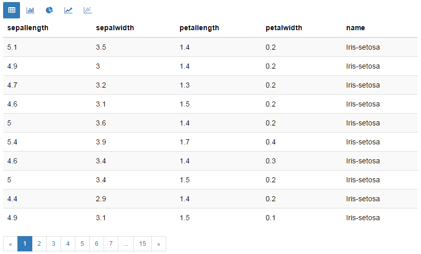
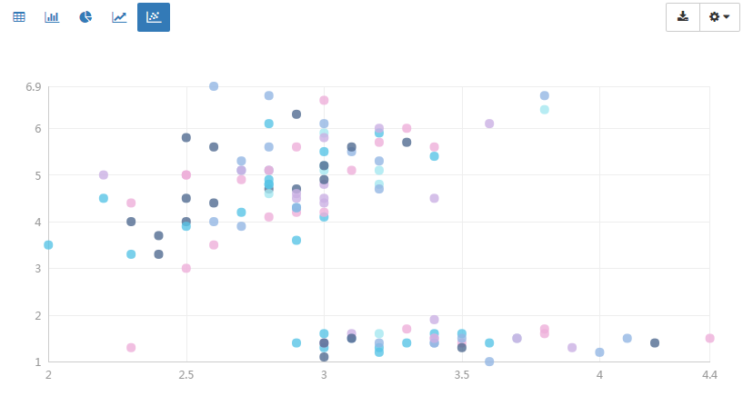
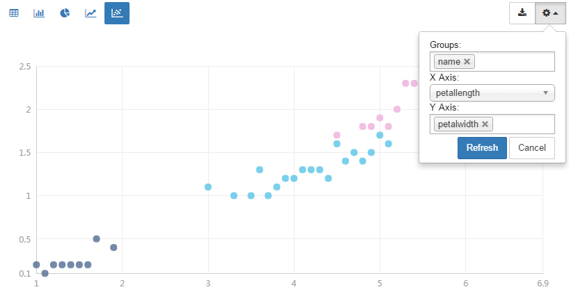
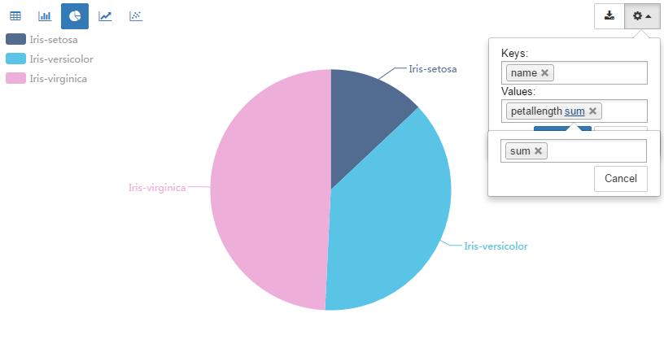
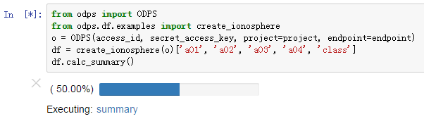
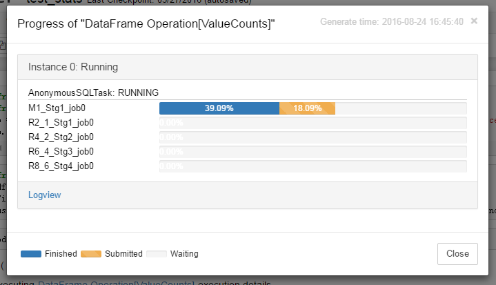

.. _cl:

************
交互体验增强
************

命令行增强
==========

PyODPS 提供了命令行下的增强工具。首先，用户可以在任何地方配置了帐号以后，下次就无需再次输入帐号信息。

.. code:: python

    from odps.inter import setup, enter, teardown

接着就可以配置帐号

.. code:: python

    setup('**your-access_id**', '**your-access-key**', '**your-project**', endpoint='**your-endpoint**')

在不指定\ ``room``\ 这个参数时，会被配置到叫做\ ``default``\ 的room里。

以后，在任何命令行打开的地方，都可以直接调用：

.. code:: python

    room = enter()

我们可以拿到ODPS的入口：

.. code:: python

    o = room.odps

.. code:: python

    o.get_table('dual')

.. parsed-literal::

    odps.Table
      name: odps_test_sqltask_finance.`dual`
      schema:
        c_int_a                 : bigint
        c_int_b                 : bigint
        c_double_a              : double
        c_double_b              : double
        c_string_a              : string
        c_string_b              : string
        c_bool_a                : boolean
        c_bool_b                : boolean
        c_datetime_a            : datetime
        c_datetime_b            : datetime

.. note::

    **注意**\ ：在重新 setup room 后，ODPS 入口对象并不会自动替换，需要再次调用 enter() 以获得新的 Room 对象。

我们可以把常用的ODPS表或者资源都可以存放在room里。

.. code:: python

    room.store('存储表示例', o.get_table('dual'), desc='简单的表存储示例')

我们可以调用\ ``display``\ 方法，来把已经存储的对象以表格的形式打印出来：

.. code:: python

    room.display()

.. raw:: html

    

    <table border="1" class="dataframe">
      <thead>
        <tr style="text-align: right;">
          <th>default</th>
          <th>desc</th>
        </tr>
        <tr>
          <th>name</th>
          <th></th>
        </tr>
      </thead>
      <tbody>
        <tr>
          <th>存储表示例</th>
          <td>简单的表存储示例</td>
        </tr>
        <tr>
          <th>iris</th>
          <td>安德森鸢尾花卉数据集</td>
        </tr>
      </tbody>
    </table>
    

我们通过\ ``room['存储表示例']``\ ，或者像\ ``room.iris``\ ，就可以取出来存储的对象了。

.. code:: python

    room['存储表示例']

.. parsed-literal::

    odps.Table
      name: odps_test_sqltask_finance.`dual`
      schema:
        c_int_a                 : bigint
        c_int_b                 : bigint
        c_double_a              : double
        c_double_b              : double
        c_string_a              : string
        c_string_b              : string
        c_bool_a                : boolean
        c_bool_b                : boolean
        c_datetime_a            : datetime
        c_datetime_b            : datetime

删除也很容易，只需要调用drop方法

.. code:: python

    room.drop('存储表示例')

.. code:: python

    room.display()

.. raw:: html

    

    <table border="1" class="dataframe">
      <thead>
        <tr style="text-align: right;">
          <th>default</th>
          <th>desc</th>
        </tr>
        <tr>
          <th>name</th>
          <th></th>
        </tr>
      </thead>
      <tbody>
        <tr>
          <th>iris</th>
          <td>安德森鸢尾花卉数据集</td>
        </tr>
      </tbody>
    </table>
    

要删除某个room，只需要调用teardown就可以了，不传参数时删除默认room。

::

    teardown()

IPython增强
===========

PyODPS 还提供了 IPython 的插件，来更方便得操作 ODPS。

首先，针对命令行增强，也有相应的命令。让我们先加载插件：

.. code:: python

    %load_ext odps

.. code:: python

    %enter

.. parsed-literal::

    <odps.inter.Room at 0x11341df10>

此时全局会包含o和odps变量，即ODPS入口。

.. code:: python

    o.get_table('dual')
    odps.get_table('dual')

.. parsed-literal::

    odps.Table
      name: odps_test_sqltask_finance.`dual`
      schema:
        c_int_a                 : bigint
        c_int_b                 : bigint
        c_double_a              : double
        c_double_b              : double
        c_string_a              : string
        c_string_b              : string
        c_bool_a                : boolean
        c_bool_b                : boolean
        c_datetime_a            : datetime
        c_datetime_b            : datetime

.. code:: python

    %stores

.. raw:: html

    

    <table border="1" class="dataframe">
      <thead>
        <tr style="text-align: right;">
          <th>default</th>
          <th>desc</th>
        </tr>
        <tr>
          <th>name</th>
          <th></th>
        </tr>
      </thead>
      <tbody>
        <tr>
          <th>iris</th>
          <td>安德森鸢尾花卉数据集</td>
        </tr>
      </tbody>
    </table>
    

对象名补全
----------
PyODPS 拓展了 IPython 原有的代码补全功能，支持在书写 ``o.get_xxx`` 这样的语句时，自动补全对象名。

例如，在 IPython 中输入下列语句（<tab>不是实际输入的字符，而是当所有输入完成后，将光标移动到相应位置，
并按 Tab 键）：

.. code-block:: python

    o.get_table(<tab>

如果已知需要补全对象的前缀，也可以使用

.. code-block:: python

    o.get_table('tabl<tab>

IPython 会自动补全前缀为 tabl 的表。

对象名补全也支持补全不同 Project 下的对象名。下列用法都被支持：

.. code-block:: python

    o.get_table(project='project_name', name='tabl<tab>
    o.get_table('tabl<tab>', project='project_name')

如果匹配的对象有多个，IPython 会给出一个列表，其最大长度由 ``options.completion_size`` 给出，
默认为 10。

SQL命令
---------

.. _sqlinter:

PyODPS 还提供了 SQL 插件，来执行 ODPS SQL。下面是单行 SQL：

.. code:: python

    %sql select * from pyodps_iris limit 5

.. raw:: html

    

    <table border="1" class="dataframe">
      <thead>
        <tr style="text-align: right;">
          <th></th>
          <th>sepallength</th>
          <th>sepalwidth</th>
          <th>petallength</th>
          <th>petalwidth</th>
          <th>name</th>
        </tr>
      </thead>
      <tbody>
        <tr>
          <th>0</th>
          <td>5.1</td>
          <td>3.5</td>
          <td>1.4</td>
          <td>0.2</td>
          <td>Iris-setosa</td>
        </tr>
        <tr>
          <th>1</th>
          <td>4.9</td>
          <td>3.0</td>
          <td>1.4</td>
          <td>0.2</td>
          <td>Iris-setosa</td>
        </tr>
        <tr>
          <th>2</th>
          <td>4.7</td>
          <td>3.2</td>
          <td>1.3</td>
          <td>0.2</td>
          <td>Iris-setosa</td>
        </tr>
        <tr>
          <th>3</th>
          <td>4.6</td>
          <td>3.1</td>
          <td>1.5</td>
          <td>0.2</td>
          <td>Iris-setosa</td>
        </tr>
        <tr>
          <th>4</th>
          <td>5.0</td>
          <td>3.6</td>
          <td>1.4</td>
          <td>0.2</td>
          <td>Iris-setosa</td>
        </tr>
      </tbody>
    </table>
    

多行SQL可以使用\ ``%%sql``\ 的命令

.. code:: python

    %%sql

    select * from pyodps_iris
    where sepallength < 5
    limit 5

.. raw:: html

    

    <table border="1" class="dataframe">
      <thead>
        <tr style="text-align: right;">
          <th></th>
          <th>sepallength</th>
          <th>sepalwidth</th>
          <th>petallength</th>
          <th>petalwidth</th>
          <th>name</th>
        </tr>
      </thead>
      <tbody>
        <tr>
          <th>0</th>
          <td>4.9</td>
          <td>3.0</td>
          <td>1.4</td>
          <td>0.2</td>
          <td>Iris-setosa</td>
        </tr>
        <tr>
          <th>1</th>
          <td>4.7</td>
          <td>3.2</td>
          <td>1.3</td>
          <td>0.2</td>
          <td>Iris-setosa</td>
        </tr>
        <tr>
          <th>2</th>
          <td>4.6</td>
          <td>3.1</td>
          <td>1.5</td>
          <td>0.2</td>
          <td>Iris-setosa</td>
        </tr>
        <tr>
          <th>3</th>
          <td>4.6</td>
          <td>3.4</td>
          <td>1.4</td>
          <td>0.3</td>
          <td>Iris-setosa</td>
        </tr>
        <tr>
          <th>4</th>
          <td>4.4</td>
          <td>2.9</td>
          <td>1.4</td>
          <td>0.2</td>
          <td>Iris-setosa</td>
        </tr>
      </tbody>
    </table>
    

.. _sqlparam:

如果想执行参数化SQL查询，则需要替换的参数可以使用\ ``:参数``\ 的方式。

.. code:: python

    In [1]: %load_ext odps

    In [2]: mytable = 'dual'

    In [3]: %sql select * from :mytable
    |==========================================|   1 /  1  (100.00%)         2s
    Out[3]:
       c_int_a  c_int_b  c_double_a  c_double_b  c_string_a  c_string_b c_bool_a  \
    0        0        0       -1203           0           0       -1203     True

      c_bool_b         c_datetime_a         c_datetime_b
    0    False  2012-03-30 23:59:58  2012-03-30 23:59:59

设置SQL运行时参数，可以通过 ``%set`` 设置到全局，或者在sql的cell里用SET进行局部设置。

.. code:: python

    In [17]: %%sql
             set odps.sql.mapper.split.size = 16;
             select * from pyodps_iris;

这个会局部设置，不会影响全局的配置。

.. code:: python

   In [18]: %set odps.sql.mapper.split.size = 16

这样设置后，后续运行的SQL都会使用这个设置。

持久化 pandas DataFrame 到 ODPS 表
----------------------------------

PyODPS 还提供把 pandas DataFrame 上传到 ODPS 表的命令:

.. code:: python

    import pandas as pd
    import numpy as np

    df = pd.DataFrame(np.arange(9).reshape(3, 3), columns=list('abc'))

.. code:: python

    %persist df pyodps_pandas_df

这里的第0个参数\ ``df``\ 是前面的变量名，\ ``pyodps_pandas_df``\ 是ODPS表名。

Jupyter Notebook 增强
=======================

PyODPS 针对 Jupyter Notebook 下的探索性数据分析进行了增强，包括结果探索功能以及进度展示功能。

结果探索
--------
PyODPS 在 Jupyter Notebook 中为 SQL Cell 和 DataFrame 提供了数据探索功能。对于已拉到本地的数据，可使用交互式的数据探索工具
浏览数据，交互式地绘制图形。

当执行结果为 DataFrame 时，PyODPS 会读取执行结果，并以分页表格的形式展示出来。单击页号或前进 / 后退按钮可在数据中导航，
如下图。

结果区的顶端为模式选择区。除数据表外，也可以选择柱状图、饼图、折线图和散点图。下图为使用默认字段选择（即前三个字段）
绘制的散点图。

在绘图模式下，单击右上角的配置按钮可以修改图表设置。如下图中，将 name 设置为分组列，X 轴选择为 petallength，Y 轴选择为
petalwidth，则图表变为下图。可见在 petallength - petalwidth 维度下，数据对 name 有较好的区分度。

对于柱状图和饼图，值字段支持选择聚合函数。PyODPS 对柱状图的默认聚合函数为 sum，对饼图则为 count。如需修改聚合函数，
可在值字段名称后的聚合函数名上单击，此后选择所需的聚合函数即可。

对于折线图，需要避免 X 轴包含空值，否则图像可能不符合预期。

完成绘图后，可单击“下载”保存绘制的图表。

.. note::

    **注意**\ ：使用此功能需要安装 Pandas ，并保证 ipywidgets 被正确安装。

进度展示
--------

大型作业执行通常需要较长的时间，因而 PyODPS 提供了进度展示功能。当 DataFrame、机器学习作业或通过 %sql 编写的
SQL 语句在 Jupyter Notebook 中执行作业时，会显示当前正在执行的作业列表及总体进度，如下图：

当点击某个作业名称上的链接时，会弹出一个对话框，显示该作业中每个 Task 的具体执行进度，如图：

当作业运行成功后，浏览器将给出提醒信息，告知作业是否成功：

.. image:: _static/exec_notify.png
