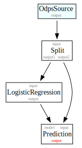

.. _pai_basic:
.. py:currentmodule:: odps.pai

============
基本概念
============

PAI SDK 中用户需要接触的对象有四种，分别是 `PAIContext`、`DataSet`、`Model` 和 `Algorithm`，分别对应上下文、数据集、
模型和算法。

在使用 PAI 之前，需要初始化 :class:`PAIContext` 上下文对象如下：

.. code-block:: python

    from odps import ODPS
    from odps.pai import PAIContext
    odps = ODPS('**your-access-id**', '**your-secret-access-key**', '**your-default-project**',
                endpoint='**your-end-point**')
    pai_context = PAIContext(odps)

===========
数据集
===========

数据集（:class:`DataSet`）是 PAI SDK 中与用户打交道最多的对象，包含对 ODPS 表和分区以及基本操作的封装以及若干属性，包括

=========== ==========================================================================================
属性         说明
=========== ==========================================================================================
字段类型      字段在ODPS中的类型
字段作用      字段在算法中的作用，包括特征、权重、标签等通用类型以及图算法中的起始顶点、终止顶点等特殊类型
字段连续性     字段的连续性，默认对 BigInt、String 和 DateTime 为离散，其余为连续，对GBDT等算法有意义
字段稀疏性     指定字段是否稀疏，以及稀疏字段的 KV 和项目间分隔符
=========== ==========================================================================================

设计数据集这一对象的目的在于将数据本身的属性和算法参数相分离。用户在某个数据上调用不同类型的算法时，无需反复考虑哪些字段需要
作为算法的输入，SDK 将帮助用户完成上述所有的步骤。如果对某字段调用 DataSet 的设置方法后，后续没有在该字段上调用与之冲突的设置
方法或算法节点，那么该字段上的设置将不会变化。

生成数据集
==============

DataSet 可以通过 PAIContext.odps_data 传入表名和分区名进行创建，如

.. code-block:: python

    dataset = pai_context.odps_data('ionosphere')

如果表为分区表，可以指定输入的分区名：

.. code-block:: python

    dataset = pai_context.odps_data('ionosphere_parted', 'pt=20160101')

DataSet 也可以通过其他 DataSet 通过变换得到。变换的过程可以是调用某个算法，也可以使用 DataSet 自己提供的方法，大多数方法调用
后都会返回一个新的DataSet对象。多个 DataSet 对象可能指向的是同一张表，也可能不指向任何表。DataSet 提供的方法列表如下：

================ ==========================================================================================
方法类型          方法名
================ ==========================================================================================
字段作用设置       select_features, exclude_fields, set_label_field, set_weight_field, set_xxxx_fields
字段连续性设置     set_continuous, set_discrete
字段稀疏性设置     set_key_value, erase_key_value
数据变换           append_id, sample, split, sql_transform
数据摘要           summary
数据 IO           store_odps, collect
================ ==========================================================================================

获取字段列表
============
字段列表可以通过 DataSet 的 fields 属性获得，结果为一个 PAIField 构成的数组，通过 Jupyter Notebook 可以直接看到表格：

.. raw:: html

    

    <table border="1" class="dataframe" cellpadding="3">
        <thead>
            <tr><th>Field</th><th>Type</th><th>Roles</th><th>Continuity</th></tr>
        </thead>
        <tbody>
            <tr><td>sepal_length</td><td>double</td><td>FEATURE</td><td>Continuous</td></tr>
            <tr><td>sepal_width</td><td>double</td><td>FEATURE</td><td>Continuous</td></tr>
            <tr><td>petal_length</td><td>double</td><td>FEATURE</td><td>Continuous</td></tr>
            <tr><td>petal_width</td><td>double</td><td>FEATURE</td><td>Continuous</td></tr>
            <tr><td>category</td><td>string</td><td>LABEL</td><td>Discrete</td></tr>
        </tbody>
    </table>
    

保存数据集
===========

使用 DataSet 的 store_odps 方法可以将数据保存回 ODPS，如

.. code-block:: python

    dataset.store_odps('result_table')

该方法也可以指定输出分区，如

.. code-block:: python

    dataset.store_odps('result_table', 'pt=20160101')

查看和使用数据
===============
使用 DataSet 的 collect 方法可以获取一定条数的数据，数据大小受到 ODPS 设置的限制。使用方法为

.. code-block:: python

    dataset.collect(100)

方法的返回值为包含结果的数组。

.. _pai_field_role:

字段作用
===========

DataSet 中，可以指定各个字段的作用，这些作用将在 DataSet 传入的算法中使用。一个字段可以有多个作用，用于针对不同的算法。

PAI SDK 中的字段作用有：

=================== ========== ============== ===========================
作用名               定义于     排除特征        描述
=================== ========== ============== ===========================
FEATURE              通用                      特征字段
LABEL                通用       是             标签字段
WEIGHT               通用       是             权重字段
PREDICTED_CLASS      通用       否             预测类别（算法自动标注）
PREDICTED_SCORE      通用       否             预测类别分值（算法自动标注）
PREDICTED_VALUE      通用       否             预测值（算法自动标注）
FROM_VERTEX          复杂网络   是             源顶点
TO_VERTEX            复杂网络   是             目标顶点
VERTEX_ID            复杂网络   是             顶点 ID
VERTEX_LABEL         复杂网络   是             顶点标签
FROM_VERTEX_LABEL    复杂网络   是             源点标签字段
TO_VERTEX_LABEL      复杂网络   是             目标点标签字段
VERTEX_WEIGHT        复杂网络   否             顶点权重字段
EDGE_WEIGHT          复杂网络   否             边权重字段
DOC_ID               NLP        是             文档 ID 字段
DOC_CONTENT          NLP        否             文档内容字段
WORD                 NLP        否             单词字段
WORD_COUNT           NLP        否             单词计数字段
REC_USER_ID          推荐       是             用户 ID 字段
REC_ITEM             推荐       是             商品字段
REC_SEQUENCE         推荐       否             事务顺序字段
REC_PAYLOAD          推荐       否             商品计数字段
=================== ========== ============== ===========================

需要注意的是，在 DataSet 上标注这些内容并不意味着算法一定支持这些标签，需要参考算法文档是否有相关字段选择参数再作判断。

PAI SDK 默认一个 DataSet 上的所有字段均为特征字段。set_xxx_fields 方法可以将某个字段设为其他作用，而 exclude_fields 会
将字段排除出特征。大多数 set_xxx_fields 方法会在设置字段作用的同时将该字段排除出特征字段，但这并不是肯定的，如上表所示。

设置字段作用的例子如下：

.. code-block:: python

    dataset = pai_context.odps_data('iris')
    labeled = dataset.set_label_field('category')

此外，为了简便标签的设置，也可以在使用 odps_data 方法从表创建 DataSet 时进行设置，例子如下：

.. code-block:: python

    dataset = pai_context.odps_data('iris', label='category')

稀疏数据
=========================
部分算法支持使用 Key-Value 格式输入稀疏数据，这在高维情形下会非常有用。用户可以通过:func:`DataSet.set_key_value`标注一个字符串
字段为稀疏字段，并指定其分隔符。设置方法为指定列名，同时指定分隔符。也可以使用:func:`DataSet.erase_key_value`清除字段上的
Key-Value 标注。

.. code-block:: python

    kv_ds = dataset.set_key_value('f1 f2', kv_delimiter=':', item_delimiter=',')

由于算法的限制，PAI SDK 仅支持对一个数据集采用一种分隔符。对于不支持稀疏的算法（其参数中无 Delimiter 选项），使用稀疏字段会
导致算法执行出错。

连续性
=========================
对于决策树等算法，字段连续性决定了该字段在算法中的处理方式。为了方便地处理连续性，PAI SDK 规定，默认 double 和 bigint 类型字段
为连续字段，其他字段为离散字段。如果需要手工设置字段连续性，可以使用 :func:`DataSet.set_continuous` 和
:func:`DataSet.set_discrete` 这两个方法。使用方式如下：

.. code-block:: python

    new_ds = dataset.set_continuous('f1 f2')
    new_ds2 = dataset.set_discrete('f1 f2')

使用 DataFrame 处理数据
=========================

PAI SDK 的每个 DataSet 对象都内嵌了 :ref:`DataFrame <df>`，并且支持用 DataFrame 的方式进行调用。例如，你可以使用`odps_data`方法打开一个
数据集，筛选一部分数据，使用逻辑回归进行训练并统计各个预测类别中有多少个样本：

.. code-block:: python

    # 这是 PAI SDK 调用
    dataset = self.pai_context.odps_data(IONOSPHERE_TABLE)
    # 这是 DataFrame 调用
    dataset = dataset[dataset.a05 != 0]
    # 这些都是 PAI SDK 调用
    train, test = dataset.split(0.6)
    lr = LogisticRegression(epsilon=0.01)
    model = lr.train(train)
    predicted = model.predict(test)
    # 这是 DataFrame 调用
    predicted.prediction_result.value_counts().to_pandas()

PAIContext 类也提供了 from_df 方法，可以从一个 DataFrame 对象创建 DataSet，具体的方法请参考 API 文档。

.. _pai_models:

===========
模型
===========

模型是 PAI SDK 中训练算法输出的训练结果。根据算法的不同，PAI SDK 提供了不同类型的模型，其中包括 PMML 模型（即 ODPS 线下模型）、
、表模型等。所有的模型都以 :class:`PAIModel` 为基类，提供 ``predict`` 方法用于在数据集上进行预测。

PMML 模型
==========
PMML 模型（:class:`PmmlModel`）针对 ODPS 中的线下模型（OfflineModel），提供了模型载入、存储和预测的功能。

PAI SDK 中无法显示创建一个模型。模型需要通过算法生成，例如下面通过逻辑回归算法生成一个模型：

.. code-block:: python

    pmml_model = LogisticRegression().train(ds)

生成模型后，可将其存储为 ODPS 线下模型（OfflineModel），此后可使用 :func:`PAIContext.odps_model` 方法从 ODPS 中重新读取：

.. code-block:: python

    pmml_model.store_odps('model_name')
    reloaded_model = pai_context.odps_model('model_name')

目前，PAI SDK 支持对随机森林模型以及逻辑回归模型进行可视化。

对于随机森林模型，调用 :func:`PmmlModel.load_segments` 方法可以获得一个数组，其中的每个元素都是一颗决策树，可以通过 root 属性获得根节点，并对
决策树进行遍历。在 Jupyter Notebook 中，也可以直接对节点进行可视化，如下面的代码，在模型中获取 ID 为 0 的决策树。如果安装有
GraphViz，那么将显示 SVG 格式的决策树，否则将显示文本格式的决策树：

.. code-block:: python

    model.load_segments()[0]

对于逻辑回归模型，调用 :func:`PmmlModel.load_regression` 方法可以获得一个数组，其中每个元素都是一条计算公式。

可以使用模型的 :func:`PmmlModel.predict` 方法对数据集进行预测操作。该方法的输出为一个新的 DataSet，除了原有列之外，还会附加
三个新字段。不同算法对这些字段的定义可能会不同，见下表：

==================== ======== ====================================================
 字段名               类型      注释
==================== ======== ====================================================
 prediction_result    string   分类算法预测标签，回归算法不适用
 prediction_score     double   分类算法权重值，对回归算法为预测结果
 prediction_detail    string   分类算法各个类别的权重值，回归算法不适用
==================== ======== ====================================================

预测时，只需要将需要预测的数据集作为参数并设置其特征即可，默认使用全部字段作为特征：

.. code-block:: python

    predicted = pmml_model.predict(input_ds.exclude_fields('label'))

表模型
==========
表模型（:class:`TablesModel`）为 PAI SDK 为方便部分将 ODPS 表作为输出的算法而设计，对应 ODPS 中的一张或几张表。这些表的表名
组成为 ``otm_模型名__表后缀``。例如，当模型名为 output_model，其中包含一张后缀为 model 的表时，该表在 ODPS 中的实际名称为
otm_output_model__model。

与 PMML 模型类似，PAI SDK 无法显示创建一个表模型，需要通过使用 TablesModel 的算法输出，例如下面通过核 SVM 算法生成一个表模型：

.. code-block:: python

    tables_model = KernelSVM().train(input_ds)

生成模型后，可存储为 ODPS 表，调用方法为:func:`TablesModel.store_odps`：

.. code-block:: python

    tables_model.store_odps('model_name')

可通过 PAIContext 提供的 list_tables_model 方法列出某个 Project 内的所有 TablesModel，也可以通过 odps_tables_model 方法进行
载入：

.. code-block:: python

    models = pai_context.list_tables_model('model_prefix')
    tables_model = pai_context.odps_tables_model('model_name')

表模型也拥有 predict 方法，可对数据集进行预测，但输出列不确定，一部分分类算法不支持输出 predict 列，具体需要参考各算法文档。

推荐模型
==========
推荐模型（:class:`TablesRecommendModel`）建立在表模型基础上，除了正常的 predict 方法外，还拥有 recommend 方法，可计算推荐结果。
该模型也可使用 :func:`PAIContext.odps_tables_model` 进行加载，PAI SDK 会自动判别类型。

===========
执行
===========

延迟执行
============

在 PAI SDK 中，我们将每个算法看作一个 Node，每个 Node 有若干个输入和输出，我们称之为 Port 。不同 Node 间通过数据的流动相连，
形成一个有向无环图。在 PAI SDK 中，每个输出 Port 可以唯一绑定一个 DataSet 或者 TrainedModel，而每一行用户代码都会通过 DataSet
提供的上游 Node 信息将该 Node 与下游 Node 相连。

PAI SDK 不会立即执行每一个 Node 对应的操作，而是等到 IO、Collect 或者 Metrics 操作被执行时，方才执行先前相关的操作。如下面的
代码段：

.. code-block:: python

    dataset1, dataset2 = pai_context.odps_data('iris').split(0.5)
    standardize(dataset1).store_odps('iris_part_std')
    normalize(dataset2)

代码中的标准化（standardize）操作会被执行，因为dataset1这条链路上执行了store_odps操作。而归一化（normalize）操作则不会被执行，
因为其链路中并不存在任何触发执行的代码。

采用延迟执行的好处有三。首先，对于存在分支的流程，延迟执行能帮助 PAI SDK 决定哪些步骤可以并行化，从而能够尽可能地利用计算资源。
其次，对于多个输出的情形，例如 TripleLDA，如果用户书写了下面的代码

.. code-block:: python

    word_stats, _, _, _, _, _ = TripleLDA(topic_num=2).transform(freq)

PAI SDK 可以使用 GC 获得真正需要的输出个数，从而避免了多余的输出操作。最后，延迟执行也能够帮助用户更快地搭建算法流程。

如果需要某个步骤立即执行，也可以在相应的 DataSet 或 Model 上执行 persist() 方法。此时，该数据对象对应的节点及所有依赖节点都将被执行。

查看执行步骤
============
PAI SDK 支持用户查看某个数据对象的执行步骤。用户只需要在 DataSet 或 Model 对象上调用 show_steps 方法即可显示该数据的执行步骤。

例如，下面的代码

.. code-block:: python

    train, test = ds.split(0.5)
    algo = LogisticRegression(tree_num=10)
    model = algo.train(train)
    predicted = model.predict(test)

执行

.. code-block:: python

    predicted.show_steps()

后，Jupyter Notebook 会显示执行步骤 DAG 图如下：

