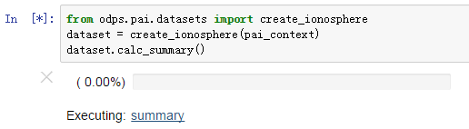
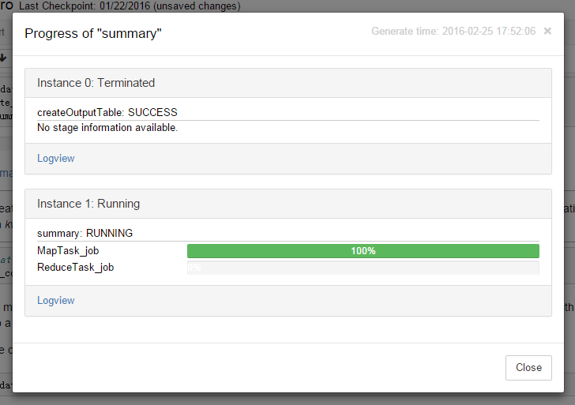
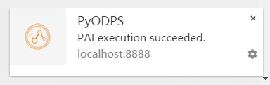
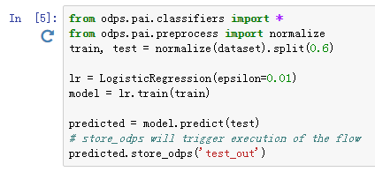

.. _pai_notebook:

==========================
Jupyter Notebook 增强
==========================

PAI SDK 针对 Jupyter Notebook 下的探索性数据分析进行了增强，包括详细的进度展示功能和即席重试功能。

进度展示
========

算法执行通常需要较长的时间，因而 PAI SDK 提供了进度展示功能。当 PAI SDK 在 Jupyter Notebook 中执行作业时，会显示当前正在执行
的作业列表及总体进度，如下图：

当点击某个作业名称上的链接时，会弹出一个对话框，显示该作业中每个 Task 的具体执行进度，如图：

当作业运行成功后，浏览器将给出提醒信息，告知作业是否成功：

即席重试
========

调参是模型训练的重要步骤。为了减少调参的步骤，PAI SDK 新增了重试执行模式。对于输入、输出都没有变化的节点，执行下列代码

.. code-block:: python

    from odps.pai.runner import set_retry_mode
    set_retry_mode(True)

此后所有配置相同且 IO 没有发生变化的节点都不会再次执行了。需要注意的是，通过代码进行重试时，如果不再需要重试，需要手动关闭此配置。

对于 Jupyter Notebook 用户而言，这一操作得到了简化。凡是有 PAI SDK 执行的 Cell，执行后会自动追加一个重试按钮，如下图：

修改参数后，再次单击此按钮，只有受到参数修改影响的算法节点会执行，其余节点都不会实际执行。

需要注意的是，所有非算法调用的代码还会被执行，因而当代码有状态时，需要慎用此功能。