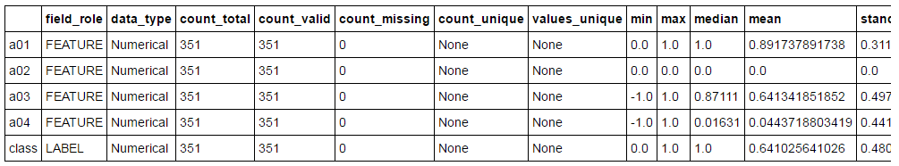
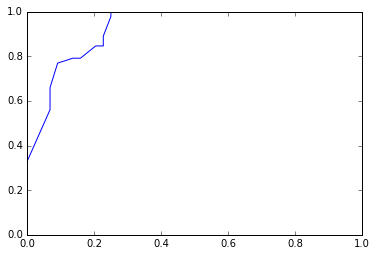

.. _pai_quickstart:

=========
快速开始
=========

开启 Jupyter Notebook，并新建一个记事本，创建一个 ODPS 对象和 PAI 上下文：

.. code-block:: python

    from odps import ODPS
    from odps.pai import PAIContext
    # ID、Key 等信息需要自行替换
    o = ODPS(access_id, secret_access_key, project=project, endpoint=endpoint)
    pai_context = PAIContext(o)

此后，创建一个范例数据集，使用 DataFrame 筛选一部分字段（注意不要遗漏标签），并查看数据的统计信息：

.. code-block:: python

    from odps.pai.datasets import create_ionosphere
    dataset = create_ionosphere(pai_context)['a01', 'a02', 'a03', 'a04', 'class']
    dataset.calc_summary()

返回的结果如下：

此后，对该数据集进行归一化，然后拆分并使用随机森林对训练集进行训练，查看输出的第一棵决策树：

.. code-block:: python

    from odps.pai.classifiers import *
    from odps.pai.preprocess import normalize
    # 归一化及拆分
    train, test = normalize(dataset).split(0.6)
    # 使用训练集训练模型
    model = RandomForests(tree_num=10).train(train)
    # 载入森林中的第一棵决策树
    model.load_segments()[0]

如果逐条执行上述语句，会发现只有 load_segments 执行时，所有代码才会执行。这是由于 PAI SDK 采用了延迟执行的方式。关于这一方式的具体细节将在“延迟执行”一节中详述。
执行完成后，显示决策树如下：

.. image:: _static/pyodps_output_decision_tree.svg

模型对象包含一个 predict 方法，可以对测试集进行预测。下面我们进行预测，将预测结果保存回 ODPS 并使用 DataFrame 进行统计：

.. code-block:: python

    # 对测试集进行预测
    predicted = model.predict(test)
    # 将结果保存到 test_out 表。这也是真正执行的步骤
    predicted.store_odps('test_out')
    # 使用 DataFrame 统计各个预测结果的个数
    predicted.prediction_result.value_counts().to_pandas()

统计结果以表格显示：

.. raw:: html

    

    <table border="1" class="dataframe" cellpadding="3">
      <thead>
        <tr style="text-align: right;">
          <th></th>
          <th>prediction_result</th>
          <th>count</th>
        </tr>
      </thead>
      <tbody>
        <tr>
          <th>0</th>
          <td>1</td>
          <td>101</td>
        </tr>
        <tr>
          <th>1</th>
          <td>0</td>
          <td>37</td>
        </tr>
      </tbody>
    </table>
    

输出预测结果后，我们便可以计算预测结果的 ROC 曲线，并使用 matplotlib 进行绘制：

.. code-block:: python

    from odps.pai.metrics import roc_curve
    import matplotlib.pyplot as plt
    %matplotlib inline

    # roc_curve 将被立即执行
    fpr, tpr, thresh = roc_curve(predicted)
    plt.plot(fpr, tpr)

IPython 给出了绘制好的 ROC 曲线如下：

pyodps/notebooks/pai_intro.ipynb 中给出了这个例子的 Notebook。