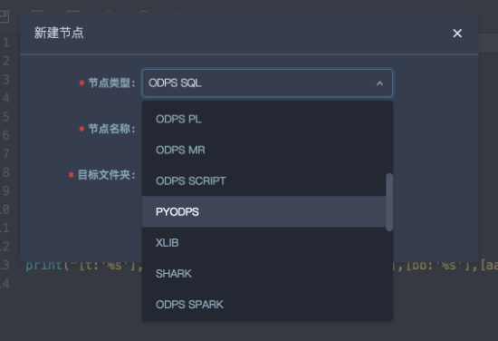

.. _d2:

=======================
DataWorks 用户使用指南
=======================

新建工作流节点
===============

在工作流节点中会包含PYODPS节点。新建即可。

ODPS入口
===========

DataWorks 的 PyODPS 节点中，将会包含一个全局的变量 ``odps`` 或者 ``o`` ，即 ODPS 入口。用户不需要手动定义 ODPS 入口。

.. code-block:: python

    print(o.exist_table('pyodps_iris'))

执行SQL
==========

可以参考 :ref:`执行SQL文档 <execute_sql>` 。

.. note::
    Dataworks 上默认没有打开 instance tunnel，即 instance.open_reader 默认走 result 接口（最多一万条）。
    打开 instance tunnel，通过 reader.count 能取到记录数，如果要迭代获取全部数据，则需要关闭 limit 限制。

要想全局打开，则

.. code-block:: python

    options.tunnel.use_instance_tunnel = True
    options.tunnel.limit_instance_tunnel = False  # 关闭 limit 读取全部数据

    with instance.open_reader() as reader:
        # 能通过 instance tunnel 读取全部数据

或者通过在 open_reader 上添加 ``tunnel=True``，来仅对这次 open_reader 打开 instance tunnel；
添加 ``limit=False``，来关闭 limit 限制从而能下载全部数据。

.. code-block:: python

    with instance.open_reader(tunnel=True, limit=False) as reader:
        # 这次 open_reader 会走 instance tunnel 接口，且能读取全部数据

DataFrame
============

执行
--------

在 DataWorks 的环境里， :ref:`DataFrame <df>` 的执行需要显式调用 :ref:`立即执行的方法（如execute，head等） <df_delay_execute>` 。

.. code-block:: python

    from odps.df import DataFrame

    iris = DataFrame(o.get_table('pyodps_iris'))
    for record in iris[iris.sepal_width < 3].execute():  # 调用立即执行的方法
        # 处理每条record

如果用户想在print的时候调用立即执行，需要打开 ``options.interactive`` 。

.. code-block:: python

    from odps import options
    from odps.df import DataFrame

    options.interactive = True  # 在开始打开开关

    iris = DataFrame(o.get_table('pyodps_iris'))
    print(iris.sepal_width.sum())  # 这里print的时候会立即执行

打印详细信息
----------------

通过设置 ``options.verbose`` 选项。在 DataWorks 上，默认已经处于打开状态，运行过程会打印 logview 等详细过程。

获取调度参数
==============

与 DataWorks 中的 SQL 节点不同，为了避免侵入代码，PyODPS 节点 **不会** 在代码中替换 ${param_name}
这样的字符串，而是在执行代码前，在全局变量中增加一个名为 ``args`` 的 dict，调度参数可以在此获取。例如，
在节点基本属性 -> 参数中设置 ``ds=${yyyymmdd}`` ，则可以通过下面的方式在代码中获取此参数

.. code-block:: python

    print('ds=' + args['ds']))

.. code-block:: text

    ds=20161116

特别地，如果要获取名为 ``ds=${yyyymmdd}`` 的分区，则可以使用

.. code-block:: python

    o.get_table('table_name').get_partition('ds=' + args['ds'])

受限功能
=========

由于缺少 matplotlib 等包，所以如下功能可能会受限。

- DataFrame的plot函数

DataFrame 自定义函数需要提交到 MaxCompute 执行。由于 Python 沙箱的原因，第三方库只支持所有的纯 Python 库以及 Numpy，
因此不能直接使用 Pandas，可参考:ref:`第三方库支持 <third_party_library>` 上传和使用所需的库。DataWorks
中执行的非自定义函数代码可以使用平台预装的 Numpy 和 Pandas。其他带有二进制代码的三方包不被支持。

由于兼容性的原因，在 DataWorks 中，`options.tunnel.use_instance_tunnel` 默认设置为 False。如果需要全局开启 Instance Tunnel，
需要手动将该值设置为 True。

由于实现的原因，Python 的 atexit 包不被支持，请使用 try - finally 结构实现相关功能。

使用限制
===========

在 DataWorks 上使用 PyODPS，为了防止对 DataWorks 的 gateway 造成压力，对内存和 CPU 都有限制。这个限制由 DataWorks 统一管理。

如果看到 **Got killed** ，即内存使用超限，进程被 kill。因此，尽量避免本地的数据操作。

通过 PyODPS 起的 SQL 和 DataFrame 任务（除 to_pandas) 不受此限制。